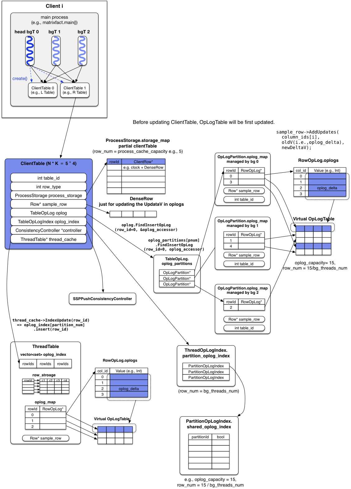

# Bosen原理

## LazyTable基本架构


1. 存放parameters的table的rows分布在多个tablet servers上。
2. 执行一个App script后，PS会在每个Client都会运行一个App program (e.g., matrixfact.main())，每个App program可以生成多个app threads。App thread相当于MapReduce/Spark中的task。
3. App thread通过client library来访问相应的table servers获取所需的table中的rows。
4. Client library维护了一个多级cache和operation logs来减少与table server的交互。

## LazyTable数据模型与访问API

### Data model: Table[row(columns)]

由于ML中算法基本使用vector或者matrix，所以可以用Table来存储参数。

与二维表类似，一个Table（比如matrixfact中的`L_Table`）包含多个row，row一般是`denseRow`或者`sparseRow`，一个row包含多个column。具体的parameter存在table中的cell中。具体实现时，Table可以用`hashmap<rowid, row>`来实现。

由于Table中的paramters会被多个threads更新，所以row支持一些聚合操作，比如plus, multiply, union。

### LazyTable操作

因为要对Table进行读写更新操作，因此Table需要支持一些操作，LazyTable的操作接口借鉴了Piccolo的接口：

1. read(tableid, rowid, slack)

   读取row，如果local cache中存在该row且其slack满足staleness bound（也就是local cache中的参数足够新），那么从local cache读取该row，否则暂停读取线程（the calling thread waits）。这个API也是唯一可以block calling thread的API。

2. update(tableid, rowid, delta)

   更新table中row的参数，newParameter = oldParameter + delta，这三个都是vector。

3. refresh(tableid, rowid, slack)

   如果process cache（被多个app thread共享）中的table中的row已经old了，就更新之。

4. clock()

   调用后表示calling thread已经进入到下一个周期，因为SSP不存在固定的barrier，所以这个看似会synchronization的API并不会block calling thread。

### Data freshness and consistency guarantees

1. 数据新鲜度保证：

   每个row有一个data age field（也就是clock）用于表示该row的数据新鲜度。假设一个row的当前data age是t，那么表示该row里面的参数 contains all updates from all app threads for1, 2, ..., t.

   对于SSP来说，当calling thread在clock t的周期内发送`read(tableid, rowid, slack)`的请求时，如果相应row的`data age >= t-1-slack`，那么该row可以返回。

2. read-my-updates:

   ready-my-updates ensures that the data read by a thread contains all its own updates.

## LazyTable系统模块之Tablet Servers

### Tablet Servers基本功能

一个逻辑上的Table可以分布存放在不同的tablet server上，比如`L_Talbe`中的 i-th row 可以存在`tablet_server_id = i % total_num_of_servers`上。每个tablet server都将rows存放在内存中。

每个tablet server使用一个vector clock（也就是`vector<Clock>`）来keep track of rows的新鲜度。vector中第i个分量表示第i个row的clock，vector中最小的clock被定义为`global_clock_value`，比如`global_clock_value = t` 表示所有的app threads都已经完成了clock t周期的计算及参数更新。问题：每个tablet server只存储table中的一部分rows，一部分rows达到了clock t就能说所有的app threads都完成了clock t周期的计算？

### Table updates

由于tablet server会不断收到来自多个app thread的update请求，tablet server会先将update请求做一个本地cache（将update请求放到pending updates list中）。当且仅当收到client发送clock()请求时，tablet server才会集中处理将这些updates。这样可以保证row的新鲜度由vector clock唯一决定。

### Table read

当tablet server收到client端发来的read请求，会先查看`global_clock_value` （为什么不是该row的data age？），如果tablet server中的row新鲜度满足requested data age要求（`global_clock_value >= t-1-slack`），那么直接返回row给client。否则，将read request放到pending read list里面，并按照requested data age排序（从大到小？）。当`global_clock_value`递增到requested data age时，tablet server再将相应的row返回给client。除了返回row，tablet server还返回data age和requester clock。前者是`global_clock_value`，后者是client's clock（说明了which updates from this client have been applied to the row data，client可以利用这个信息来清除一些本地的oplogs）。

## LazyTable系统模块之Client library

Client library与app threads在同一个process，用于将LazyTable API的调用转成message发送到tablet server。Client library包含多层caches和operation logs。Client library会创建一个或多个background threads （简称为bg threds）来完成propagating updates和receiving rows的工作。

Client library由两层 caches/oplogs 组成：process cache/oplog和thread cache/oplog。Process cache/oplog被同在一个进程中的所有app thread和bg thread共享。Each thread cache/oplog is exclusively associated with one app thread.（实现好像不是这样的）。Thread cache的引入可以避免在process cache端有过多的锁同步，但是只能cache一些rows。

Client library也使用vector clock来track app thread的clock，第i个分量代表第i个app thread已经进入的clock周期。

### Client updates
App thread调用update(deltas)后，会先去访问对应的thread cache/oplog，如果cache中相应的row存在，那么`thread.cache.row += update.deltas`，同时会update写入到oplog中。不存在就直接存起来。当app thread调用clock()，那么在thread oplog中的updates都会被push到process oplog中，同时`process.cache.row += updates.deltas`。如果thread cache/oplog不存在，update会直接被push到process cache/oplog。

当一个client process中所有app threads都完成clock为 t 的计算周期，client library会使用一个bg thread（是head bg thread么？）向table server发送一个消息，这个消息包含clock t，process oplogs中clock为 t 的updates。这些process cache/oplogs中的updates会在发送该消息后一直保留，直到收到server返回的更新后的rows。

### Client read

在clock t周期内，如果一个app thread想要去读row r with a slack of s，那么client library会将这个请求翻译成`read row r with data age >= t-s-1`。接着，client library会先去thread cache中找对应的且满足条件的row，如果不存在就去process cache中找，如果还找不到就向tablet server发送要read row r的请求，同时block calling thread，直到server返回row r。在process cache中每个row有一个tag来表示是否有row request正在被处理，这样可以同步其它的request统一row的请求。

当tablet server返回row r时，client library端有一个bg thread会接受到row r，同时接受requester clock rc。rc表示该client提交的clock t的updates已经被处理。之后，process oplog就可以清除`clock <= rc` 的update日志。为了保证 read-my-updates，接收到row r 后，会将process oplog中`clock > rc`的操作作用到row r上，这样就可以得到本地最新的row r。最后，前面接受row r的bg thread会跟心row r的clock并将其返回到waiting app threads。


## Prefetching and fault-tolerance
### 数据预取

LazyTable提供了预取API refresh()，函数参数与read()一样，但与read()不一样的地方是refresh()不会block calling thread。

LazyTable支持两种预取机制：conservative prefetching和aggressive prefetching。前者只在必要的时候进行refresh，如果`cache_age < t-s-1`，prefetcher才会发送一个`request(row = r, age >= t-s-1)`。对于Aggressive prefetching，如果当前的row不是最新的会主动去更新。


# Bosen的线程启动过程分析

Start PS的第一个步骤就是初始化各个线程
```c++
petuum::PSTableGroup::Init(table_group_config, false)
```
其具体实现是
- 初始化每个node上的namenode，background及server threads
- 建立这些threads之间的通信关系
- 为createTables()做准备

## Namenode thread
一个Petuum cluster里面只有一个Namenode thread，负责协同各个节点上的bg threads和server threads。


## Server thread
角色是PS中的Server，负责管理建立和维护用于存放parameters的global tables。

## Background (Bg) thread
角色是PS中的Client，负责管理真正计算的worker threads，并与server thread通信。在每个node上，bg threads可以有多个，其中一个负责建立本地 table。

## 代码结构与流程
.png)


## Local 模式线程启动分析

启动流程

```c++
// main thread调用PSTableGroup::Init()后变成init thread并向CommBus注册自己
I1230 10:00:50.570231  9821 comm_bus.cpp:117] CommBus ThreadRegister()
// init thread创建Namenode thread，该向CommBus注册自己
I1230 10:01:16.210435 10014 comm_bus.cpp:117] CommBus ThreadRegister()
// Namenode thread启动
NameNode is ready to accept connections!
// cluster中bg thread的个数
I1230 10:05:09.398447 10014 name_node_thread.cpp:126] Number total_bg_threads() = 1
// cluster中的server thread的个数
I1230 10:05:09.398485 10014 name_node_thread.cpp:128] Number total_server_threads() = 1
// app中定义的table_group_config的consistency_model = SSPPush or SSP
I1230 10:06:24.141788  9821 server_threads.cpp:92] RowSubscribe = SSPPushRowSubscribe
// 启动（pthread_create）所有的local server threads，这里只有一个
I1230 10:09:50.340092  9821 server_threads.cpp:106] Create server thread 0
// Server thread获取cluster中的client个数
I1230 10:12:15.419473 10137 server_threads.cpp:239] ServerThreads num_clients = 1
// Server thread自己的thread id
I1230 10:12:15.419505 10137 server_threads.cpp:240] my id = 1
// Server thread向CommBus注册自己
I1230 10:12:15.419514 10137 comm_bus.cpp:117] CommBus ThreadRegister()
// 注册成功
I1230 10:12:15.419587 10137 server_threads.cpp:252] Server thread registered CommBus
// Bg thread启动，id = 100，Bg thread的id从100开始
I1230 10:12:51.534554 10171 bg_workers.cpp:889] Bg Worker starts here, my_id = 100
// Bg thread向CommBus注册自己
I1230 10:12:51.534627 10171 comm_bus.cpp:117] CommBus ThreadRegister()
// Bg thread先去connect Namenode thread
I1230 10:12:51.534677 10171 bg_workers.cpp:283] ConnectToNameNodeOrServer server_id = 0
// Bg thread去连接Namenode thread
I1230 10:12:51.534683 10171 bg_workers.cpp:290] Connect to local server 0
// Namenode thread 收到Bg thread id = 100的请求
I1230 10:12:51.534826 10014 name_node_thread.cpp:139] Name node gets client 100
// Server thread首先去连接Namenode thread
I1230 10:13:18.879250 10137 server_threads.cpp:141] Connect to local name node
// Namenode thread收到Server thread的请求
I1230 10:13:21.051105 10014 name_node_thread.cpp:142] Name node gets server 1
// Namenode已经收到所有的client和server的连接请求
I1230 10:13:33.913213 10014 name_node_thread.cpp:149] Has received connections from all clients and servers, sending out connect_server_msg
// Namenode向所有client (bg thread) 发送让其连接server thread的命令
I1230 10:13:33.913254 10014 name_node_thread.cpp:156] Send connect_server_msg done
// 发送connect_server_msg命令完毕
I1230 10:13:33.913261 10014 name_node_thread.cpp:162] InitNameNode done
// 每个bg thread去连接cluster中的所有的server threads，这里只有一个server thread
I1230 10:13:33.929790 10171 bg_workers.cpp:283] ConnectToNameNodeOrServer server_id = 1
// Bg thread连接上了server thread
I1230 10:13:33.929821 10171 bg_workers.cpp:290] Connect to local server 1
// 收到Namenode的连接反馈消息（client_start_msg表示连接成功)
I1230 10:13:33.929862 10171 bg_workers.cpp:368] get kClientStart from 0 num_started_servers = 0
// Server thread初始化完成
I1230 10:23:39.355000 10137 server_threads.cpp:187] InitNonNameNode done
// Bg thread收到server thread的反馈信息（client_start_msg表示连接成功)
I1230 10:23:39.355051 10171 bg_workers.cpp:368] get kClientStart from 1 num_started_servers = 1
// Bg thread id＝100收到CreateTable的请求
I1230 10:23:39.355198 10171 bg_workers.cpp:911] head bg handles CreateTable
Data mode: Loading matrix sampledata/9x9_3blocks into memory...
```
Thread Ids: （local模式下Namenode，Server及Bg thread都只有一个）
- 9821: main() thread
- 10014: Namenode thread
- 10137: Server thread
- 10171: Bg thread

图解如下：


## Distributed 模式线程启动分析

启动图解如下：


可以看到各个节点上的线程启动后，Server threads和Bg threads都与Namenode threads建立了连接。然后Namenode通知所有的bg threads与集群中的所有server threads建立连接。连接建立后，可以看到Server threads和Bg threads组成了一个二分图结构，也就是所谓的Parameter Server。

# ServerThreads

## 基本结构
1. 每个client上的app进程持有一个ServerThreads object，这个object管理该client上的所有server threads。这些server threads的启动过程：`app.main() => PSTableGroup::Init() => ServerThreads::Init() => ServerThreadMain(threadId) for each server thread`。
2. 每个server thread实际上是一个Server object。ServerThreads对象通过`vector<pthread_t> threads`和`vector<int> threads_ids`来引用server threads，通过其ServerContex指针用来访问每个server thread对应的Server object（`server_context_ptr->server_obj`）。
3. 对于每一个server thread，都持有一个ServerContext，其初始化时`server_context.bg_threads_ids`存储PS中所有bg threads的`bg_thread_id`，`server_context.server_obj`存储该server thread对应的Server object。
4. 每个Server object里面存放了三个数据结构：`client_bg_map<client_id, bg_id>`存放PS中有那些client，每个client上有那些bg threads；`client_ids`存放PS中有那些client；`client_clocks`是VectorClock，存放来自client的clock，初始化时clock为0。每个Server thread在初始化时会去connect PS中所有的bg thread，然后将`(client_id, 0)`添加到server thread对应的Server object中的`client_clocks`中。如果某个client上有多个bg thread，那么`(client_id, 0)`会被重复添加到`client_clocks: VectorClock`中，会做替换。注意`client_clocks: VectorClock`的长度为PS中client的总个数，也就是每一个client对应一个clock，而不是每个bg thread对应一个clock。Server object还有一个`client_vector_clock_map<int, VectorClock>`的数据结构，key为`client_id`，value为该client上所有bg thread的VectorClock。也就是说每个server thread不仅存放了每个client的clock，也存放了该client上每个bg thread的clock。
5. Server object还有一个`bg_version_map<bg_thread_id, int>`的数据结构，该结构用于存放server thread收到的bg thread的最新oplog版本。

## CreateTable

Server thread启动后，会不断循环等待消息，当收到Namenode发来的`create_table_msg`时，会调用`HandleCreateTable(create_table_msg)`来createTable，会经历以下步骤：

1. 从msg中提取出tableId。
2. 回复消息给Namenode说准备创建table。
3. 初始化TableInfo消息，包括table的`staleness, row_type, columnNum (row_capacity)`。
4. 然后调用server thread对应的Server object创建table，使用`Server.CreateTable(table_id, table_info)`。
5. Server object里面有个`map<table_id, ServerTable> tables`数据结构，`CreateTable(table_id)`就是new出一个ServerTable，然后将其加入这个map。
6. ServerTable object会存放`table_info`，并且有一个`map<row_id, ServerRow> storage`，这个map用来存放ServerTable中的rows。另外还有一个`tmp_row_buff[row_length]`的buffer。new ServerTable时，只是初始化一些这些数据结构。

## HandleClientSendOpLogMsg

当某个server thread收到client里bg thread发来的`client_send_oplog_msg`时，会调用ServerThreads的`HandleOpLogMsg(client_send_oplog_msg)`，该函数会执行如下步骤：

1. 从msg中抽取出`client_id`，判断该msg是否是clock信息，并提取出oplog的version。
2. 调用server thread对应的`ServerObj.ApplyOpLog(client_send_oplog_msg)`。该函数会将oplog中的updates requests都更新到本server thread维护的ServerTable。
3. 如果msg中没有携带clock信息，那么执行结束，否则继续下面的步骤：
4. 调用`ServerObj.Clock(client_id, bg_id)`，并返回`bool clock_changed`。该函数会更新client的VectorClock（也就是每个bg thread的clock），如果client的VectorClock中唯一最小的clock被更新，那么client本身的clock也需要更新，这种情况下`clock_changed`为true。
5. 如果`clock_changed == false`，那么结束，否则，进行下面的步骤：
6. `vector<ServerRowRequest> requests = serverObject.GetFulfilledRowRequests()`。
7. 对每一个request，提取其`table_id, row_id, bg_id`，然后算出bg thread的`version = serverObj.GetBgVersion(bg_id)`。
8. 根据提取的`row_id`去Server object的ServerTable中提取对应的row，使用方法`ServerRow server_row = ServerObj.FindCreateRow(table_id, row_id)`。
9. 调用`RowSubscribe(server_row, bg_id_to_client_id)`。如果consistency model是SSP，那么RowSubscribe就是SSPRowSubscribe；如果是SSP push，那么RowSubscribe就是SSPPushRowSubscribe。NMF使用是后者，因此这一步就是`SSPPushRowSubscribe(server_row, bg_id_to_client_id)`。该方法的意思是将`client_id`注册到该`server_row`，这样将该`server_row`在调用`AppendRowToBuffs`可以使用`callback_subs.AppendRowToBuffs()`。
10. 查看Server object中VectorClock中的最小clock，使用方法`server_clock = ServerObj.GetMinClock()`。
11. `ReplyRowRequest(bg_id, server_row, table_id, row_id, sersver_clock)`。
12. 最后调用`ServerPushRow()`。

### `Server.ApplyOpLog(oplog, bg_thread_id, version)`

1. check一下，确保自己`bg_version_map`中该bg thread对应的version比这个新来的version小1。
2. 更新`bg_version_map[bg_thread_id] = version`。
3. oplog里面可以存在多个update request，对于每一个update request，执行以下步骤：
4. 读取oplog中的`table_id, row_id, column_ids, num_updates, started_new_table`到updates。
5. 根据`table_id`从`ServerObj.tables`中找出对应的ServerTable。
6. 执行ServerTable的`ApplyRowOpLog(row_id, column_ids, updates, num_updates)`。该方法会找出ServerTable对应的row，并对row进行`BatchInc(column_ids, updates)`。如果ServerTable不存在该row，就先`CreateRow(row_id)`，然后`BatchInc()`。
7. 打出"Read and Apply Update Done"的日志。

### `ServerObj.Clock(client_id, bg_id)`

1. 执行`ServerObj.client_vector_clock_map[client_id].Tick(bg_id)`，该函数将client对应的VectorClock中`bg_id`对应的clock加1。
2. 如果`bg_id`对应的原始clock是VectorClock中最小值，且是唯一的最小值，那么clock+1后，需要更新client对应的clock，也就是对`client_clocks.Tick(client_id)`。
3. 然后看是否达到了snapshot的clock，达到就进行checkpoint。

## HandleRowRequestMsg

当某个server thread收到client里bg thread发来的`row_request_msg`时，会调用ServerThreads的`HandleRowRequest(bg_id, row_request_msg)`，该函数会执行如下步骤：

1. 从msg中提取出`table_id, row_id, clock`。
2. 查看ServerObj中的所有client的最小clock。使用`server_clock = ServerObj.GetMinClock()`。
3. 如果msg请求信息中的clock > `server_clock`，也就是说目前有些clients在clock时的更新信息还没有收到，那么先将这个msg的request存起来，等到ServerTable更新到clock时，再reply。具体会执行`ServerObj.AddRowRequest(sender_id, table_id, row_id, clock)`。
4. 如果msg请求信息中的clock  <= `server_clock`，也就是说ServerTable中存在满足clock要求的rows，那么会执行如下步骤：
5. 得到`bg_id`的version，使用`version = ServerObj.GetBgVersion(sender_id)`，`sender_id`就是发送`row_request_msg`请求的client上面的bg thread。
6. 将ServerTable中被request的row取出来到`server_row`。
7. 调用`RowSubscribe(server_row, sender_id_to_thread_id)`。
8. 将`server_row`reply给bg thread，具体使用`ReplyRowRequest(sender_id, server_row, table_id, row_id, server_clock, version)`。


### `ServerObj.AddRowRequest(sender_id, table_id, row_id, clock)`

当来自client的request当前无法被处理的时候（server的row太old），server会调用这个函数将请求先放到队列里。具体执行如下步骤：

1. 先new一个ServerRowRequest的结构体，将`bg_id, table_id, row_id, clock`放到这个结构体中。
2. 将ServerRowRequest放进`map<clock, vector<ServerRowRequest>> clock_bg_row_requests`中，该数据结构的key是clock，vector中的index是`bg_id`，value是ServerRowRequest。

### `ReplyRowRequest(sender_id, server_row, table_id, row_id, server_clock, version)`

1. 先构造一个`ServerRowRequestReplyMsg`，然后将`table_id, row_id, server_clock, version`填入这个msg中。
2. 然后将msg序列化后发回给`bg_id`对应的bg thread。

# CreateTable过程

## 基本流程

1. 每个App main Thread（比如每个节点上matrixfact.main()进程的main/init thread）调用`petuum::PSTableGroup::CreateTable(tableId, table_config)`来创建Table。
2. 该方法会调用同在一个Process里的head bg thread向NameNode thread发送创建Table的请求`create_table_msg`。
3. NameNode收到CreateTable请求，如果该Table还未创建，就在自己的线程里创建一个ServerTable。之后会忽略其他要创建同一Table的请求。
4. NameNode将CreateTable请求`create_table_msg`发送到cluster中的每个Server thread。
5. Server thread收到CreateTable请求后，先reply `create_table_reply_msg` to NameNode thread，表示自己已经知道要创建Table，然后直接在线程里创建一个ServerTable。
6. 当NameNode thread收到cluster中所有Server thread返回的reply消息后，就开始reply `create_table_reply_msg` to head bg thread说“Table已被ServerThreads创建”。
7. 当App main()里定义的所有的Table都被创建完毕（比如matrixfact里要创建三个Table），NameNode thread会向cluster中所有head bg thread发送“所有的Tables都被创建了”的消息，也就是`created_all_tables_msg`。

## 流程图


## 代码结构图


# ClientTable Update

##  总体架构


这个是物理架构图，但实际实现比这张图复杂。可以看到为了减少Server里Table的访问次数，Petuum在Client端设计了两级缓存，分别是Thread级别和Process级别的缓存。

## ClientTable结构图


ClientTable实际存放在ProcessStorage中，但相对于ServerTable来说，ProcessStorage中存放的Table只是ServerTable的一部分，甚至可以设置ClientTable的row_num为0，这样就可以减少Client端的内存使用量。

## ClientTable初始化

ClientTable属性：

| Name | Default | Description | L Table |
|:-----|:------|:-------|:-------|
| table\_info.row\_type| N/A | row type (e.g., 0 表示 DenseRow) | 0 |
| process\_cache\_capacity| 0 | Table 里的 row个数| matrix.getN() |
| table\_info.row\_capacity| 0 | 对于 DenseRow，指column个数，对SparseRow无效| K |
| table\_info.table_staleness | 0 | SSP staleness | 0 |
| table\_info.oplog\_capacity | 0 | OpLogTable里面最多可以写入多少个row | 100 |

每个bg thread持有一个OpLogTable，OpLogTable的`row_num = oplog_capacity / bg_threads_num`。

代码分析：

```c++
void SSPConsistencyController::BatchInc(int32_t row_id,
  const int32_t* column_ids, const void* updates, int32_t num_updates) {

  // updates就是每个col上要increase的value。
  // 比如，col 1和col 3都要加1，那么column_ids = {1, 3}，updates = {1, 1}
  // thread_cache_是ThreadTable的指针，ThreadTable就是ClientTable或者ServerTable
  // IndexUpadte(row_id)会
  thread_cache_->IndexUpdate(row_id);

  OpLogAccessor oplog_accessor;
  oplog_.FindInsertOpLog(row_id, &oplog_accessor);

  const uint8_t* deltas_uint8 = reinterpret_cast<const uint8_t*>(updates);

  for (int i = 0; i < num_updates; ++i) {
    void *oplog_delta = oplog_accessor.FindCreate(column_ids[i]);
    sample_row_->AddUpdates(column_ids[i], oplog_delta, deltas_uint8
			    + sample_row_->get_update_size()*i);
  }

  RowAccessor row_accessor;
  bool found = process_storage_.Find(row_id, &row_accessor);
  if (found) {
    row_accessor.GetRowData()->ApplyBatchInc(column_ids, updates,
                                             num_updates);
  }
}
```


## ClientTable属性解释

```c++
Class ClientTable {
	private:
	  // table Id
	  int32_t table_id_;
	  // Table里面row的类型，比如DenseRow<float>
	  int32_t row_type_;
	  // Row的游标（指针）
	  const AbstractRow* const sample_row_;
	  // Table的更新日志
	  TableOpLog oplog_;
	  // 进程里cache的Table
	  ProcessStorage process_storage_;
	  // Table的一致性控制协议
	  AbstractConsistencyController *consistency_controller_;

	  // ThreadTable就是ClientTable或者ServerTable
	  // thread_cahce就是Threads维护的ClientTable的全局对象
	  boost::thread_specific_ptr<ThreadTable> thread_cache_;
	  // 操作日志，每个bg thread对应一个index value
	  TableOpLogIndex oplog_index_;
}
```

# BgWorkers

BgWorkers的角色与ServerThreads的角色类似，都是管理本进程里的bg/server threads。BgWorker通过BgContext来管理，ServerThreads通过ServerContext来管理。

BgContext里面存放了以下数据结构：

```c++
int version;   // version of the data, increment when a set of OpLogs
               // are sent out; may wrap around
               // More specifically, version denotes the version of the
               // OpLogs that haven't been sent out.
               // version表示client端的最新opLog还没有发送给server
RowRequestOpLogMgr *row_request_oplog_mgr;

// initialized by BgThreadMain(), used in CreateSendOpLogs()
// For server x, table y, the size of serialized OpLog is ...
map<serverId, map<int32_t, size_t> > server_table_oplog_size_map;
// The OpLog msg to each server
map<serverId,, ClientSendOpLogMsg* > server_oplog_msg_map;
// map server id to oplog msg size
map<serverId,, size_t> server_oplog_msg_size_map;
// size of oplog per table, reused across multiple tables
map<int32_t, size_t> table_server_oplog_size_map;

/* Data members needed for server push */
VectorClock server_vector_clock;
```

## Bg thread初始化

1. 在bg thread初始化时会先打印出来“Bg Worker starts here, my id = 100/1100”。
2. InitBgContext()。设置一下`bg_context->row_request_oplog_mgr = new SSPPushRowRequestOpLogMgr`。然后对PS中的每一个`serverId`，将其放入下列数据结构，`server_table_oplog_size_map.insert(serverId, map<int, int>())`，`server_oplog_msg_map.insert(serverId, 0)`，`server_oplog_msg_size_map.insert(serverId, 0)`，`table_server_oplog_size_map.insert(serverId, 0)`，`server_vector_clock.AddClock(serverId)`。AddClock会将`serverId, clock=0`放入到`server_vector_clock`中。
3. BgServerHanshake()。

	```
	1. 通过ConnectToNameNodeOrServer(name_node_id)连接Namenode。
	      首先打印出"ConnectToNameNodeOrServer server_id"。
	      然后将自己的client_id填入到ClientConnectMsg中。
	      最后将msg发送给server_id对应的local/remote server thread（这里是Namenode thread）。
	2. 等待Namenode返回的ConnectServerMsg (kConnectServer)消息。
	3. 连接PS里面的每个server thread，仍然是通过ConnectToNameNodeOrServer(server_id)。
	4. 等待，直到收到所有server thread返回的kClientStart信息，每收到一条信息就会打印"get kClientStart from server_id"。
	5. 收到namenode和所有server返回的信息后，退出。
	```
4. 解除`pthread_barrier_wait`。
5. 去接受本进程内的AppInitThread的连接。使用`RecvAppInitThreadConnection()`去接受连接，连接消息类型是kAppConnect。
6. 如果本bg thread是head bg thread（第一个bg thread）就要承担CreateClientTable的任务，先打印"head bg handles CreateTable"，然后调用HandleCreateTables()，然后wait直到Table创建完成。
7. 最后便进入了无限等待循环，等待接受msg，处理msg。

### HandleCreateTables()

> the app thread shall not submit another create table request before the current one returns as it is blocked waiting

1. 假设要create 3 tables，那么会去`comm_bus`索取这每个table的BgCreateTableMsg (kBgCreateTable)，然后从msg中提取`staleness, row_type, row_capacity, process_cache_capacity, thread_cache_capacity, oplog_capacity`。
2. 将`table_id, staleness, row_type, row_capacity`包装成`CreateTableMsg`，然后将该msg发送到Namenode。
3. 等待接收Namenode的反馈信息CreateTableReplyMsg (kCreateTableReply)，收到就说明namenode已经知道head bg thread要创建ClientTable。
4. 然后可以创建`client_table = new ClientTable(table_id, client_table_config)`。
5. 将`client_table`放进`map<table_id, ClientTable> tables`里。
6. 打印"Reply app thread"，回复app init thread表示ClientTable已经创建。

### `ClientTable(table_id, client_table_config)`

与ServerTable直接存储parameter rows不同，ClientTable是一个逻辑概念，它相当于一个ServerTable的buffer/cache，app thread将最新的参数先写入到这个buffer，然后push到Server上。从Server端pull parameter rows的时候也一样，先pull到ClientTable里面然后读到app thread里面。


1. 提取`table_id, row_type`。
2. 创建一个`Row sample_row`，创建这个row只是用来使用Row中的函数，而不是ClientTable中实际存储value的row，实际的row存放在`process_storage`中。
3. 初始化一下oplog，oplog用于存储parameter的本地更新，也就是实际的updated value。有几个bg thread，就有几个oplog.opLogPartition。
4. 初始化`process_storage(config.process_cache_capacity)`。`process_storage`被所有thread共享，里面存储了ClientTable的实际rows，但由于`process_storage`有大小限制（row的个数），可能存储ClientTable的一部分，完整的Table存放在Server端。
5. 初始化`oplog_index`，目前还不知道这个东西是干嘛的？
6. 设置Table的一致性控制器，如果是SSP协议就使用SSPConsistencyController，如果是SSPPush协议，使用SSPPushConsistencyController。

## 当bg thread收到kAppConnect消息

1. `++num_connected_app_threads`

## 当bg thread收到kRowRequest消息

1. 接收到`row_request_msg`，类型是RowRequestMsg。
2. 调用`CheckForwardRowRequestToServer(sender_id, row_request_msg)`来处理rowRequest消息，`sender_id`就是app thread id。

### `CheckForwardRowRequestToServer(app_thread_id, row_request_msg)`

1. 从msg中提取出`table_id, row_id, clock`。
2. 从tables中找到`table_id`对应的ClientTable table。
3. 提取出table对应的ProcessStorage，并去该storage中查找`row_id`对应的row。
4. 如果找到了对应的row，且row的clock满足要求（row.clock >= request.clock），那么只是发一个空RowRequestReplyMsg消息给app thread，然后return。如果没找到对应的row，那就要去server端取，会执行下面的步骤：
5. 构造一个RowRequestInfo，初始化它的`app_thread_id, clock = row_request_msg.clock, version = bgThread.version - 1`。Version in request denotes the update version that the row on server can see. Which should be 1 less than the current version number。
6. 将这个RowRequestInfo加入到RowRequestOpLogMgr中，使用`bgThread.row_request_oplog_mgr->AddRowRequest(row_request, table_id, row_id)`。
7. 如果必须send这个RowRequestInfo（本地最新更新也没有）到server，就会先根据`row_id`计算存储该`row_id`的`server_id`（通过GetRowPartitionServerID(table_id, row_id)，只是简单地`server_ids[row_id % num_server]`），然后发`row_request_msg`请求给server。

### `SSPRowRequestOpLogMgr.AddRowRequest(row_request, table_id, row_id)`

1. 提取出request的version (也就是bgThread.version - 1)。
2. request.sent = true。
3. 去`map<(tableId, rowId), list<RowRequestInfo> > bgThread.row_request_oplog_mgr.pending_row_requests`里取出`(request.table_id, request.row_id)`对应的list<RowRequestInfo>，然后从后往前查看，将request插入到合适的位置，使得prev.clock < request.clock < next.clock。如果插入成功，那么会打印"I'm requesting clock is request.clock. There's a previous request requesting clock is prev.clock."。然后将request.sent设置为false（意思是不用send request到server端，先暂时保存），`request_added`设置为true。
4. `++version_request_cnt_map[version]`。


> 可见在client和server端之间不仅要cache push/pull的parameters，还要cache push/pull的requests。

## 当bg thread收到kServerRowRequestReply消息

1. 收到ServerRowRequestReplyMsg消息
2. 处理消息`HandleServerRowRequestReply(server_id, server_row_request_reply_msg)`。

### `HandleServerRowRequestReply(server_id, server_row_request_reply_msg)`

1. 先从msg中提取出`table_id, row_id, clock, version`。
2. 从bgWorkers.tables中找到`table_id`对应的ClientTable。
3. 将msg中的row反序列化出来，放到`Row *row_data`中。
4. 将msg的version信息添加到`bgThread.row_request_oplog_mgr`中，使用`bgThread.row_request_oplog_mgr->ServerAcknowledgeVersion(server_id, version)`。
5. 处理row，使用`ApplyOpLogsAndInsertRow(table_id, client_table, row_id, version, row_data, clock)`。
6. `int clock_to_request = bgThread.row_request_oplog_mgr->InformReply(table_id, row_id, clock, bgThread.version, &app_thread_ids)`。
7. 如果`clock_to_request > 0`，那么构造RowRequestMsg，将`tabel_id, row_id, clock_to_request`填进msg。根据`table_id, row_id`计算存放该row的server thread，然后将msg发给server，并打印“send to server + serverId”。
8. 构造一个空的RowRequestReplyMsg，发送给每个app thread。


### `row_request_oplog_mgr.ServerAcknowledgeVersion(server_id, version)`
目前RowRequestOpLogMgr中的方法都会调用其子类SSPRowRequestOpLogMgr中的方法。本方法目前为空。

### `ApplyOpLogsAndInsertRow(table_id, client_table, row_id, version, row_data, clock)`

Step 1：该函数首先执行`ApplyOldOpLogsToRowData(table_id, client_table, row_id, row_version, row_data)`，具体执行如下步骤：

1. 如果msg.version + 1 >=  bgThread.version，那么直接return。
2. 调用`bg_oplog = bgThread.row_request_oplog_mgr->OpLogIterInit(version + 1, bgThread.version - 1)`。
3. `oplog_version = version + 1`。
4. 对于每一条`bg_oplog: BgOpLog`执行如下操作：
5. 得到`table_id`对应的BgOpLogPartitions，使用`BgOpLogPartition *bg_oplog_partition = bg_oplog->Get(table_id)`。
6. `RowOpLog *row_oplog = bg_oplog_partition->FindOpLog(row_id)`。
7. 如果`row_oplog`不为空，将RowOpLog中的update都更新到`row_data`上。
8. 然后去获得下一条`bg_oplog`，使用`bg_oplog = bgThread.row_request_oplog_mgr->OpLogIterNext(&oplog_version)`。该函数会调用`SSPRowRequestOpLogMgr.GetOpLog(version)`去`version_oplog_map<version, oplog:BgOpLog>`那里获得oplog。

BgOpLog和TableOpLog不一样，BgOpLog自带的数据结构是`map<table_id, BgOpLogPartition*> table_oplog_map`。BgOpLog由RowRequest OpLogMgr自带的`map<version, BgOpLog*> version_oplog_map`持有，而RowRequestOpLogMgr由每个bg thread持有。RowRequestOpLogMgr有两个子类：SSPRowRequestOpLogMgr和SSPPushRowRequestOpLogMgr。TableOpLog由每个ClientTable对象持有。BgOpLog对row request进行cache，而TableOpLog对parameter updates进行cache。

Step 2：`ClientRow *client_row = CreateClientRowFunc(clock, row_data)`

Step 3：获取ClientTable的oplog，使用`TableOpLog &table_oplog = client_table->get_oplog()`。

Step 4：提取TableOpLog中对应的row的oplogs，然后更新到`row_data`上。

Step 5：最后将`(row_id, client_row)`插入到ClientTable的`process_storage`中。

> 整个过程可以看到，先new出来一个新的row，然后将BgThread.BgOpLog持有的一些RowOpLog更新到row上，接着将ClientTable持有的RowOpLog更新到row上。


### `row_request_oplog_mgr.InformReply(table_id, row_id, clock, bgThread.version, &app_thread_ids)`


## SSPRowRequestOpLogMgr逻辑

1. 负责持有client**待发往**或者**已发往**server的row requests。这些row不在本地process cache中。
2. 如果requested row不在本地cache中，bg worker会询问RowRequestMgr是否已经发出了改row的request，如果没有，那么就send该row的request，否则，就等待server response。
3. 当bg worker收到该row的reply时，它会将该row insert到process cache中，然后使用RowRequestMgr检查哪些buffered row request可以被reply。
4. 从一个row reqeust被bg worker发到server，到bg worker接收server reply的这段时间内，bg worker可能已经发了多组row update requests到server。Server端会buffer这些row然后等到一定时间再update server端的ServerTable，然后再reply。
5. Bg worker为每一组updates分配一个单调递增的version number。本地的version number表示已经被发往server的updates最新版本。当一个row request被发送的时候，它会包含本地最新的version number。Server接收和处理messages会按照一定的顺序，当server在处理一个row request的时候，比该row request version小的row requests会先被处理，也就是说server按照version顺序来处理同一row的requests。
6. 当server buffer一个client发来的row request后，又收到同一个client发来的一组updates的时候，server会增加这个已经被buffer的row request的version。这样，当client收到这个row request的reply的时候，它会通过version知道哪些updates已经被server更新，之后在将row插入到process cache之前，会将missing掉的updates应用到row上。
7. RowRequestMgr也负责跟踪管理sent oplog。一个oplog会一直存在不被删掉，直到在此version之前的row requests都已经被reply。
